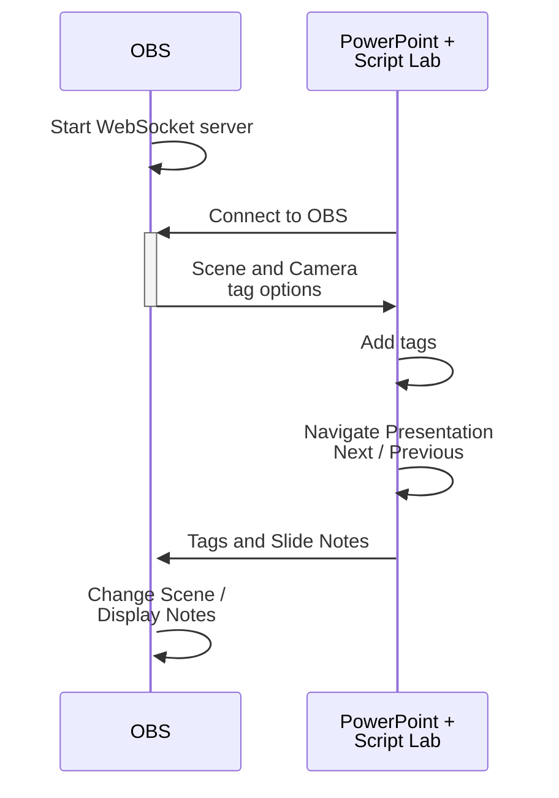
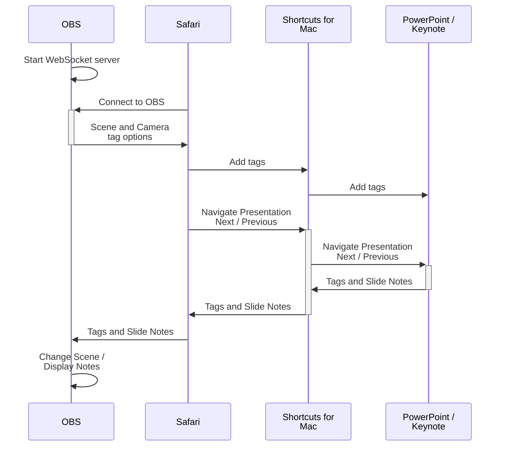

# UUinsome 
This repo contains scripts to connect Open Broadcast Studio (OBS) and PowerPoint on Windows and Mac.

Features:

  - Change OBS Scenes with PowerPoint slide tags.
  - Scrolling slide notes 
  - Use OBS Hotkeys to navigate slides 
  
# Table of Content
- [Prerequisite](#prerequisite)
- [Getting Started on Windows](#getting-started-on-windows)
  - [Overview](#overview)
  - [Setup OBS](#setup-obs)
  - [Setup PowerPoint](#setup-powerpoint)
  - [Using UUinsome](#using-uuinsome)
- [Getting Started on MacOS](#getting-started-on-macos)
  - [Overview](#overview-1)
  - [Setup OBS](#setup-obs-1)
  - [Import Shortcuts](#import-shortcuts)

## Prerequisite
- [Open Broadcast Studio (obs)](https://obsproject.com/)
- Windows
  - PowerPoint
- MacOS
  - Chrome
  - Shortcuts
  - PowerPoint or Keynote 

## Getting Started on Windows
### Overview
[Getting started video](https://youtu.be/yMh8dkbfDEE)

### Setup OBS
  #### Import the [UUinsome Windows Scene Collection](https://github.com/UUoocl/UUinsome/blob/main/UUinsome_OBS_Collections/UUinsome_Windows_Collection.json)

In OBS 
- Click **Scene Collection > Import**
- Choose the "UUinsome Windows Collection"
- Switch to the UUinsome Windows Collection

#### Start the OBS Web Socket Server. 
In the OBS Tools menu, click "WebSocket Server Settings"
 - Check "Enable WebSocket server"
 - Click "Show Connect Info", and copy the password.

### Setup PowerPoint
#### Install the PowerPoint add-in Script Lab
Script Lab is a free PowerPoint add-in by Microsoft. 

In PowerPoint click "Add-Ins" and search for Script Lab. 

#### Import UUinsome Script Lab script
Copy the UUinsome script from this repo [UUinsome Script Lab](https://github.com/UUoocl/UUinsome/blob/main/ScriptLab/UUinsome.txt)

In PowerPoint use the "Script Lab" tab to open the code editor. 
CLick Import and paste the UUinsome script into the text editor. 

Click the Run button to start the UUinsome script

### Using UUinsome
#### Connect PowerPoint to OBS

In PowerPoint enter the OBS WenSocket Server password into the UUinsome window. 

#### Adding Slide Tags

#### Teleprompter Setting
- Speed
- Size

#### Navigating Slides

#### Adding Notes

## Getting Started on MacOS

### Overview

> [!NOTE]
> In MacOS Script Lab doesn't support WebSockets. The Safari Browser and Shortcuts app is used instead of Script Lab. 
> 

### Setup OBS
 - Import the [UUinsome macOS Collection](https://github.com/UUoocl/UUinsome/blob/main/UUinsome_OBS_Collections/UUinsome_macOS_Collection.json)

#### Start the OBS Web Socket Server. 
In the OBS Tools menu, click "WebSocket Server Settings"
 - Check "Enable WebSocket server"
 - Click "Show Connect Info", and copy the password.

### Import Shortcuts
Shortcuts is an automation app included with macOS.  These scripts created in Shortcuts will control PowerPoint and send data back to OBS. 

Download the Shortcuts from this repo [Apple Shortcuts](https://github.com/UUoocl/UUinsome/tree/main/Apple_Shortcuts)

In the Shortcuts app, click **File > Import...**

