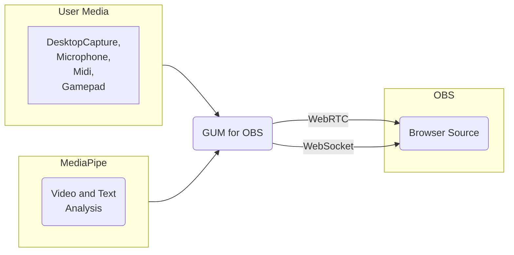
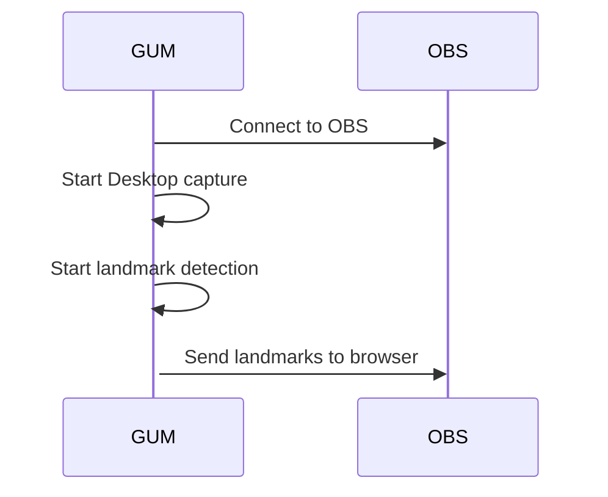
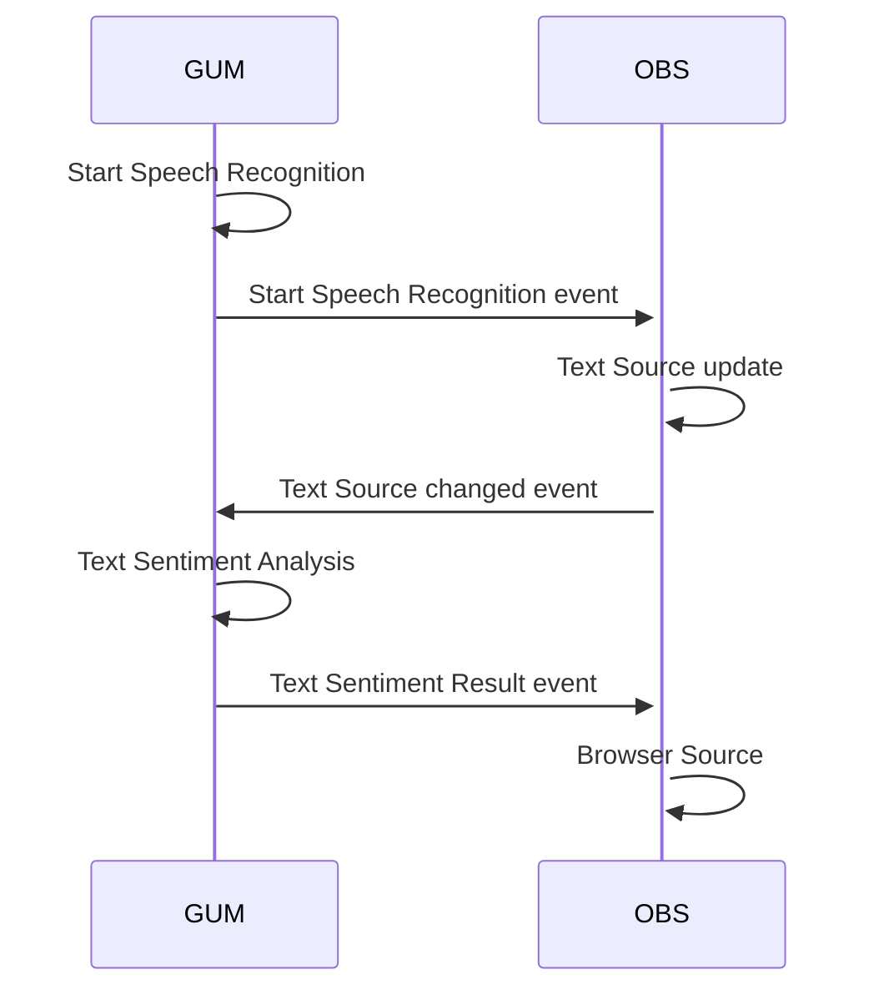

# Get User Media(GUM) for OBS

<!-- ToC begin -->
<a id="toc"></a>

- [Get User Media(GUM) for OBS](#get-user-mediagum-for-obs)
  - [Overview](#overview)
  - [Getting Started](#getting-started)
    - [Enable the OBS WebSocket Server](#enable-the-obs-websocket-server)
    - [Connect to the OBS WebSocket Server](#connect-to-the-obs-websocket-server)
    - [Capture Audio or Desktop](#capture-audio-or-desktop)
  - [Audio Frequency Analysis](#audio-frequency-analysis)
    - [Audio Frequency Message](#audio-frequency-message)
  - [MIDI Input](#midi-input)
    - [MIDI Output Message](#midi-output-message)
  - [Gamepad Input](#gamepad-input)
    - [Gamepad Output Message](#gamepad-output-message)
  - [MediaPipe Landmarks](#mediapipe-landmarks)
  - [MediaPipe Pose Landmarks](#mediapipe-pose-landmarks)
    - [Output Message](#output-message)
  - [MediaPipe Hand Landmarks](#mediapipe-hand-landmarks)
    - [Output Message](#output-message-1)
  - [MediaPipe Face Landmarks](#mediapipe-face-landmarks)
    - [Output Message](#output-message-2)
  - [MediaPipe Image Segmentation](#mediapipe-image-segmentation)
    - [Output Message](#output-message-3)
  - [MediaPipe Text Sentiment](#mediapipe-text-sentiment)
    - [Text Sentiment Result Message](#text-sentiment-result-message)
  - [MediaPipe Gemma LLM Inference](#mediapipe-gemma-llm-inference)
    - [Output Message](#output-message-4)
  - [WebRTC Audio Video](#webrtc-audio-video)
    - [Output Message](#output-message-5)
  - [Speech Recognition](#speech-recognition)
    - [Speech Recognition Started Event Message](#speech-recognition-started-event-message)
    - [Speech Recognition Event Message](#speech-recognition-event-message)

<!-- Generated by gh-toc, https://moonbase59.github.io/gh-toc/ -->
<!-- ToC end -->
## Overview
The OBS Browser Source doesn't support direct access to media like Camera, Microphone, Desktop Capture, Midi and Game Controllers. 
The Get User Media for OBS sends media from a Chrome Browser to the OBS Browser source. 


## Getting Started
Open [GUM for OBS](https://obsgum.github.io/) in a Chrome browser.  
Optionally, download and run GUM for OBS locally.  
> :memo: **Note:** The WebSpeech API doesn't work off-line. The WebSpeech API is used for Speech Recognition. Google annouced at [I/O 2024 that local off-line WebSpeech is coming soon](https://youtu.be/PJm8WNajZtw?si=tW8ZtjAnWwvGxFt8&t=1873).
<br>Use the OBS Plug-in "[Local Vocal](https://obsproject.com/forum/resources/localvocal-local-live-captions-translation-on-the-go.1769/)" when running GUM for OBS offline.    

### Enable the OBS WebSocket Server
Open [OBS](https://obsproject.com/).
1. In the menu bar click Tools --> WebSocket Server Settings
2. Check the box to "Enable WebSocket Server"
3. Click the "Show Connect Info" button
4. copy the password

### Connect to the OBS WebSocket Server
<p></p>
On the GUM for OBS page enter the OBS WebSocket Server details in the IP address, Port Number and Password fields. 
Click the "Connect to OBS" button.  If the connection is successful the button color will turn to green. 

### Capture Audio or Desktop
- To capture a desktop window, check the "Desktop Window" box. [how to create an OBS projector window](#add-an-obs-scene-and-source)
- To capture a microphone, check the "Microphone" box. 
> :memo: **Note:** if you are only using Midi or Gamepad inputs choosing a window or microphone to capture is optional.  

#### Add an OBS Scene and Sourced
1. Create a Scene named "Scene"
2. Add a Video Capture Device source


3. Open a preview window
  - right click on the "Video Capture Device" source
  - click "Windowed Projector (Source)"
  - 

## Audio Frequency Analysis
The audio data from the selected microphone is sent to OBS as a browser event message. 
By default messages are sent 1 per second.  The frames per second can be set to a preferred speed.
### Audio Frequency Message
**Message name:** audio-input

**Event listener example**
```javascript
window.addEventListener("audio-input", function (event) {
    console.log("audio received: ",event)
    document.getElementById("audioFFT").innerText = JSON.stringify(event.detail);
  });
```

**Event data**

Audio is processed into 128 key value pairs.  
Object 
```JSON
{
    "dataArray": {
        "0": 177,
        "1": 179,
        ...
        "127": 0
    }
}
```

## MIDI Input
The MIDI data from detected devices is sent to OBS as a browser event message. 
The webMIDI.js library is used to process the MIDI devices and messages. 

### MIDI Output Message
**Message name:** midi-message

**Event listener example**
```javascript
window.addEventListener("midi-message", function (event) {
    //console.log("midi received: ",event)
    document.getElementById("midiMessage").innerText = JSON.stringify(
      event.detail
    );
  });
```

**Event data**
The MIDI event message includes the "deviceName" and "midiEvent" details.  
 
Object 
```JSON
{
    "deviceName": "iPad",
    "midiEvent": "{\"rawData\":{\"0\":144,\"1\":62,\"2\":0},\"data\":[144,62,0],\"statusByte\":144,\"rawDataBytes\":{\"0\":62,\"1\":0},\"dataBytes\":[62,0],\"isChannelMessage\":true,\"isSystemMessage\":false,\"command\":9,\"channel\":1,\"type\":\"noteon\"}"
}
```
## Gamepad Input
The Gamepad data from detected devices is sent to OBS as a browser event message. 

### Gamepad Output Message
**Message name:** gamepad-message

**Event listener example**
```javascript
  window.addEventListener("gamepad-message", function (event) {
    console.log("gamepad-message received: ",event)
    document.getElementById("gamepad-message").innerText = JSON.stringify(
      event.detail
    );
  });
```

**Event data**
The Gamepad event message details are sent as string.  
 
Object 
```JSON
{
    "gamepadEvent": "{\n  \"index\": 0,\n  \"id\": \"8BitDo Micro gamepad (Vendor: 2dc8 Product: 9020)\",\n  \"mapping\": \"\",\n  \"axes\": [\n    -0.003921568393707275,\n    -0.003921568393707275,\n    -0.003921568393707275,\n    0,\n    -1,\n    -0.003921568393707275,\n    0,\n    0,\n    0,\n    1.2857143878936768\n  ],\n  \"buttons\": [\n    {\n      \"pressed\": false,\n      \"touched\": false,\n      \"value\": 0\n    },\n    {\n      \"pressed\": false,\n      \"touched\": false,\n      \"value\": 0\n    },\n    {\n      \"pressed\": false,\n      \"touched\": false,\n      \"value\": 0\n    },\n    {\n      \"pressed\": false,\n      \"touched\": false,\n      \"value\": 0\n    },\n    {\n      \"pressed\": false,\n      \"touched\": false,\n      \"value\": 0\n    },\n    {\n      \"pressed\": false,\n      \"touched\": false,\n      \"value\": 0\n    },\n    {\n      \"pressed\": false,\n      \"touched\": false,\n      \"value\": 0\n    },\n    {\n      \"pressed\": false,\n      \"touched\": false,\n      \"value\": 0\n    },\n    {\n      \"pressed\": false,\n      \"touched\": false,\n      \"value\": 0\n    },\n    {\n      \"pressed\": false,\n      \"touched\": false,\n      \"value\": 0\n    },\n    {\n      \"pressed\": false,\n      \"touched\": false,\n      \"value\": 0\n    },\n    {\n      \"pressed\": false,\n      \"touched\": false,\n      \"value\": 0\n    },\n    {\n      \"pressed\": false,\n      \"touched\": false,\n      \"value\": 0\n    },\n    {\n      \"pressed\": false,\n      \"touched\": false,\n      \"value\": 0\n    },\n    {\n      \"pressed\": false,\n      \"touched\": false,\n      \"value\": 0\n    },\n    {\n      \"pressed\": false,\n      \"touched\": false,\n      \"value\": 0\n    }\n  ],\n  \"vibrationActuator\": null\n}"
}
```
 
 ## MediaPipe Landmarks
The [Google MediaPipe](https://ai.google.dev/edge/mediapipe/solutions/studio) ML models are used dectect pose, hand and face landmarks.  Deteced landmarks are sent to OBS Browsers.   


 ## MediaPipe Pose Landmarks


|0 - nose |10 - mouth (right)|20 - right index|30 - right heel|
|---|---|---|---|
|1 - left eye (inner) |11 - left shoulder|21 - left thumb|31 - left foot index|
|2 - left eye |12 - right shoulder|22 - right thumb|32 - right foot index|
|3 - left eye (outer)|13 - left elbow|23 - left hip|
|4 - right eye (inner) |14 - right elbow|24 - right hip|
|5 - right eye |15 - left wrist|25 - left knee|
|6 - right eye (outer) |16 - right wrist|26 - right knee|
|7 - left ear |17 - left pinky|27 - left ankle|
|8 - right ear |18 - right pinky|28 - right ankle|
|9 - mouth (left) |19 - left index|29 - left heel|


### Output Message
**Message name:** 

**Event listener example**
```javascript
window.addEventListener("pose-landmarks", function (event) {
    //Do Something
  });
```

**Event data**
 
Object 
```JSON
{
    "poseLandmarkerResult": [
        {
            "visibility": 0.999914288520813,
            "x": 0.5488027334213257,
            "y": 0.629255473613739,
            "z": -1.2427579164505005
        },
        {
            "visibility": 0.9997429847717285,
            "x": 0.5757827758789062,
            "y": 0.5809763669967651,
            "z": -1.1561990976333618
        },
        {
            "visibility": 0.9997959733009338,
            "x": 0.5933735966682434,
            "y": 0.5823040008544922,
            "z": -1.1562100648880005
        },
        {
            "visibility": 0.9996959567070007,
            "x": 0.6136075258255005,
            "y": 0.5847325921058655,
            "z": -1.1562097072601318
        }
        ...33 landmarks in the array
    ]
}
```

## MediaPipe Hand Landmarks

### Output Message
**Message name:** 

**Event listener example**
```javascript
window.addEventListener("hand-landmarks", function (event) {
    //Do Something
  });
```

**Event data**
 
Object 
```JSON
{
    "handLandmarkEventData": "[[{\"x\":0.8247250318527222,\"y\":0.856696605682373,\"z\":1.8380380595317547e-7,\"visibility\":0},{\"x\":0.7507635354995728,\"y\":0.8093991279602051,\"z\":0.02939540520310402,\"visibility\":0},{\"x\":0.7328766584396362,\"y\":0.7667005062103271,\"z\":0.06088247895240784,\"visibility\":0},{\"x\":0.7351902723312378,\"y\":0.7290223240852356,\"z\":0.08172444999217987,\"visibility\":0},{\"x\":0.7417455911636353,\"y\":0.6961146593093872,\"z\":0.10279053449630737,\"visibility\":0},{\"x\":0.8058651685714722,\"y\":0.7270944118499756,\"z\":0.11451881378889084,\"visibility\":0},{\"x\":0.8048328161239624,\"y\":0.677108645439148,\"z\":0.14171048998832703,\"visibility\":0},{\"x\":0.8037340641021729,\"y\":0.6428552269935608,\"z\":0.14268162846565247,\"visibility\":0},{\"x\":0.8021656274795532,\"y\":0.6135662794113159,\"z\":0.1384235918521881,\"visibility\":0},{\"x\":0.8407263159751892,\"y\":0.7240689396858215,\"z\":0.09554439783096313,\"visibility\":0},{\"x\":0.8443264961242676,\"y\":0.6634253263473511,\"z\":0.1236325055360794,\"visibility\":0},{\"x\":0.8433619737625122,\"y\":0.620961606502533,\"z\":0.11451881378889084,\"visibility\":0},{\"x\":0.8402864933013916,\"y\":0.5901913642883301,\"z\":0.10323875397443771,\"visibility\":0},{\"x\":0.8709547519683838,\"y\":0.724621593952179,\"z\":0.07126611471176147,\"visibility\":0},{\"x\":0.8794510364532471,\"y\":0.6672875285148621,\"z\":0.08956820517778397,\"visibility\":0},{\"x\":0.8782241940498352,\"y\":0.6270310878753662,\"z\":0.08052921295166016,\"visibility\":0},{\"x\":0.8781704306602478,\"y\":0.5951124429702759,\"z\":0.06988411396741867,\"visibility\":0},{\"x\":0.9020516872406006,\"y\":0.7279819846153259,\"z\":0.046539608389139175,\"visibility\":0},{\"x\":0.9133985042572021,\"y\":0.6810554265975952,\"z\":0.055541250854730606,\"visibility\":0},{\"x\":0.9148292541503906,\"y\":0.6508065462112427,\"z\":0.05386044830083847,\"visibility\":0},{\"x\":0.9161320924758911,\"y\":0.621634304523468,\"z\":0.0499759167432785,\"visibility\":0}]]"
}
```

## MediaPipe Face Landmarks

### Output Message
**Message name:** 

**Event listener example**
```javascript
window.addEventListener("face-landmarks", function (event) {
    //Do Something
  });
```

**Event data**
 
Object 
```JSON
{
    "faceLandmarkerResult": {
        "faceBlendshapes": [
            {
                "categories": [
                    {
                        "categoryName": "_neutral",
                        "displayName": "",
                        "index": 0,
                        "score": 0.000002109876049871673
                    },
                    {
                        "categoryName": "browDownLeft",
                        "displayName": "",
                        "index": 1,
                        "score": 0.022858552634716034
                    },
                    {
                        "categoryName": "browDownRight",
                        "displayName": "",
                        "index": 2,
                        "score": 0.012267393060028553
                    },
                    {
                        "categoryName": "browInnerUp",
                        "displayName": "",
                        "index": 3,
                        "score": 0.02032194845378399
                    },
                    {
                        "categoryName": "browOuterUpLeft",
                        "displayName": "",
                        "index": 4,
                        "score": 0.10230637341737747
                    },
                    {
                        "categoryName": "browOuterUpRight",
                        "displayName": "",
                        "index": 5,
                        "score": 0.11128177493810654
                    },
                    {
                        "categoryName": "cheekPuff",
                        "displayName": "",
                        "index": 6,
                        "score": 0.000046493329136865214
                    },
                    {
                        "categoryName": "cheekSquintLeft",
                        "displayName": "",
                        "index": 7,
                        "score": 5.526308655134926e-8
                    },
                    {
                        "categoryName": "cheekSquintRight",
                        "displayName": "",
                        "index": 8,
                        "score": 3.7752269577140396e-7
                    },
                    {
                        "categoryName": "eyeBlinkLeft",
                        "displayName": "",
                        "index": 9,
                        "score": 0.15118007361888885
                    },
                    {
                        "categoryName": "eyeBlinkRight",
                        "displayName": "",
                        "index": 10,
                        "score": 0.19274845719337463
                    },
                    {
                        "categoryName": "eyeLookDownLeft",
                        "displayName": "",
                        "index": 11,
                        "score": 0.12557381391525269
                    },
                    {
                        "categoryName": "eyeLookDownRight",
                        "displayName": "",
                        "index": 12,
                        "score": 0.16864973306655884
                    },
                    {
                        "categoryName": "eyeLookInLeft",
                        "displayName": "",
                        "index": 13,
                        "score": 0.004771905019879341
                    },
                    {
                        "categoryName": "eyeLookInRight",
                        "displayName": "",
                        "index": 14,
                        "score": 0.32876813411712646
                    },
                    {
                        "categoryName": "eyeLookOutLeft",
                        "displayName": "",
                        "index": 15,
                        "score": 0.34337201714515686
                    },
                    {
                        "categoryName": "eyeLookOutRight",
                        "displayName": "",
                        "index": 16,
                        "score": 0.020578913390636444
                    },
                    {
                        "categoryName": "eyeLookUpLeft",
                        "displayName": "",
                        "index": 17,
                        "score": 0.0757729560136795
                    },
                    {
                        "categoryName": "eyeLookUpRight",
                        "displayName": "",
                        "index": 18,
                        "score": 0.05410344526171684
                    },
                    {
                        "categoryName": "eyeSquintLeft",
                        "displayName": "",
                        "index": 19,
                        "score": 0.41864877939224243
                    },
                    {
                        "categoryName": "eyeSquintRight",
                        "displayName": "",
                        "index": 20,
                        "score": 0.3198547065258026
                    },
                    {
                        "categoryName": "eyeWideLeft",
                        "displayName": "",
                        "index": 21,
                        "score": 0.00384839647449553
                    },
                    {
                        "categoryName": "eyeWideRight",
                        "displayName": "",
                        "index": 22,
                        "score": 0.0023359579499810934
                    },
                    {
                        "categoryName": "jawForward",
                        "displayName": "",
                        "index": 23,
                        "score": 0.00011548112524906173
                    },
                    {
                        "categoryName": "jawLeft",
                        "displayName": "",
                        "index": 24,
                        "score": 0.0018875936511904001
                    },
                    {
                        "categoryName": "jawOpen",
                        "displayName": "",
                        "index": 25,
                        "score": 0.01698133535683155
                    },
                    {
                        "categoryName": "jawRight",
                        "displayName": "",
                        "index": 26,
                        "score": 0.000013287482033774722
                    },
                    {
                        "categoryName": "mouthClose",
                        "displayName": "",
                        "index": 27,
                        "score": 0.011766532436013222
                    },
                    {
                        "categoryName": "mouthDimpleLeft",
                        "displayName": "",
                        "index": 28,
                        "score": 0.03745143115520477
                    },
                    {
                        "categoryName": "mouthDimpleRight",
                        "displayName": "",
                        "index": 29,
                        "score": 0.014166870154440403
                    },
                    {
                        "categoryName": "mouthFrownLeft",
                        "displayName": "",
                        "index": 30,
                        "score": 0.000045591590605909005
                    },
                    {
                        "categoryName": "mouthFrownRight",
                        "displayName": "",
                        "index": 31,
                        "score": 0.00006781705451430753
                    },
                    {
                        "categoryName": "mouthFunnel",
                        "displayName": "",
                        "index": 32,
                        "score": 0.00022527173859998584
                    },
                    {
                        "categoryName": "mouthLeft",
                        "displayName": "",
                        "index": 33,
                        "score": 0.009081831201910973
                    },
                    {
                        "categoryName": "mouthLowerDownLeft",
                        "displayName": "",
                        "index": 34,
                        "score": 0.00025259150424972177
                    },
                    {
                        "categoryName": "mouthLowerDownRight",
                        "displayName": "",
                        "index": 35,
                        "score": 0.00023906173009891063
                    },
                    {
                        "categoryName": "mouthPressLeft",
                        "displayName": "",
                        "index": 36,
                        "score": 0.21130135655403137
                    },
                    {
                        "categoryName": "mouthPressRight",
                        "displayName": "",
                        "index": 37,
                        "score": 0.19805218279361725
                    },
                    {
                        "categoryName": "mouthPucker",
                        "displayName": "",
                        "index": 38,
                        "score": 0.0006105230422690511
                    },
                    {
                        "categoryName": "mouthRight",
                        "displayName": "",
                        "index": 39,
                        "score": 0.00007372746040346101
                    },
                    {
                        "categoryName": "mouthRollLower",
                        "displayName": "",
                        "index": 40,
                        "score": 0.01968102902173996
                    },
                    {
                        "categoryName": "mouthRollUpper",
                        "displayName": "",
                        "index": 41,
                        "score": 0.036269523203372955
                    },
                    {
                        "categoryName": "mouthShrugLower",
                        "displayName": "",
                        "index": 42,
                        "score": 0.006083718501031399
                    },
                    {
                        "categoryName": "mouthShrugUpper",
                        "displayName": "",
                        "index": 43,
                        "score": 0.0012678722850978374
                    },
                    {
                        "categoryName": "mouthSmileLeft",
                        "displayName": "",
                        "index": 44,
                        "score": 0.02724362537264824
                    },
                    {
                        "categoryName": "mouthSmileRight",
                        "displayName": "",
                        "index": 45,
                        "score": 0.032555971294641495
                    },
                    {
                        "categoryName": "mouthStretchLeft",
                        "displayName": "",
                        "index": 46,
                        "score": 0.0018876483663916588
                    },
                    {
                        "categoryName": "mouthStretchRight",
                        "displayName": "",
                        "index": 47,
                        "score": 0.011493757367134094
                    },
                    {
                        "categoryName": "mouthUpperUpLeft",
                        "displayName": "",
                        "index": 48,
                        "score": 0.00006508542719529942
                    },
                    {
                        "categoryName": "mouthUpperUpRight",
                        "displayName": "",
                        "index": 49,
                        "score": 0.00009459078864892945
                    },
                    {
                        "categoryName": "noseSneerLeft",
                        "displayName": "",
                        "index": 50,
                        "score": 3.0407329631998437e-7
                    },
                    {
                        "categoryName": "noseSneerRight",
                        "displayName": "",
                        "index": 51,
                        "score": 7.242805963869614e-7
                    }
                ],
                "headIndex": -1,
                "headName": ""
            }
        ],
        "faceLandmarks": [],
        "facialTransformationMatrixes": []
    }
}
```

## MediaPipe Image Segmentation

### Output Message
**Message name:** 

**Event listener example**
```javascript
window.addEventListener("message", function (event) {
    //Do Something
  });
```

**Event data**
 
Object 
```JSON
{

}
```

## MediaPipe Text Sentiment
After starting Speech Recognition the MediaPipe Text Sentiment can be used. 

The Text Sentiment function is triggered by changes to the OBS Text Source created for Speech Recognition.



### Text Sentiment Result Message
**Message name:** sentimentResult

**Event listener example**
```javascript
window.addEventListener("message", function (event) {
    //Do Something
  });
```

**Event data**
 
Object 
```JSON
{

}
```

## MediaPipe Gemma LLM Inference

### Output Message
**Message name:** 

**Event listener example**
```javascript
window.addEventListener("message", function (event) {
    //Do Something
  });
```

**Event data**
 
Object 
```JSON
{

}
```

## WebRTC Audio Video

### Output Message
**Message name:** 

**Event listener example**
```javascript
window.addEventListener("message", function (event) {
    //Do Something
  });
```

**Event data**
 
Object 
```JSON
{

}
```

## Speech Recognition
The [Web Speech API](https://developer.mozilla.org/en-US/docs/Web/API/Web_Speech_API) is used to convert microphone input to text.

The output text is sent to 2 OBS sources.  
1. an event message is sent to the OBS Browser
2. An OBS Text Source
  - In OBS, create a Text source to receive the output
  - In GUM for OBS, enter the Text source name 

Example use: [lib/speechBGcolorChange.html](https://github.com/UUoocl/GUM/blob/main/obs_browser_examples/speechBGcolorChange.html)

### Speech Recognition Started Event Message
This event is sent after clicking the "Start Speech Recognition" button
**Message name:**  speechRecognition-started
**Event listener example**
```javascript
window.addEventListener("speechRecognition-started", function (event) {
    //Do Something
  });
```

**Event data**
 
Object 
```JSON
{
    "obs_textSourceName": "speechRecognition"
}
```

### Speech Recognition Event Message
**Message name:**  speechRecognition

**Event listener example**
```javascript
window.addEventListener("speechRecognition", function (event) {
    //Do Something
  });
```

**Event data**
 
Object 
```JSON
{

}
```


<!-- ##  Input

###  Output Message
**Message name:** 
**Event listener example**
```javascript
window.addEventListener("message", function (event) {
    //Do Something
  });
```

**Event data**
 
Object 
```JSON
{

}
``` -->
